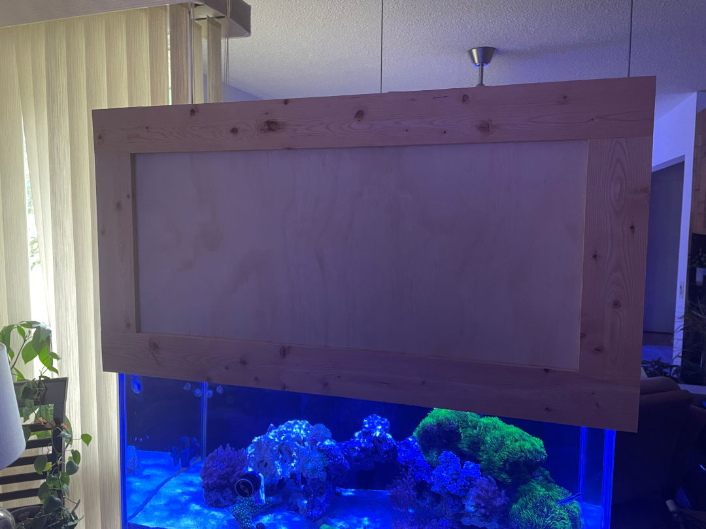
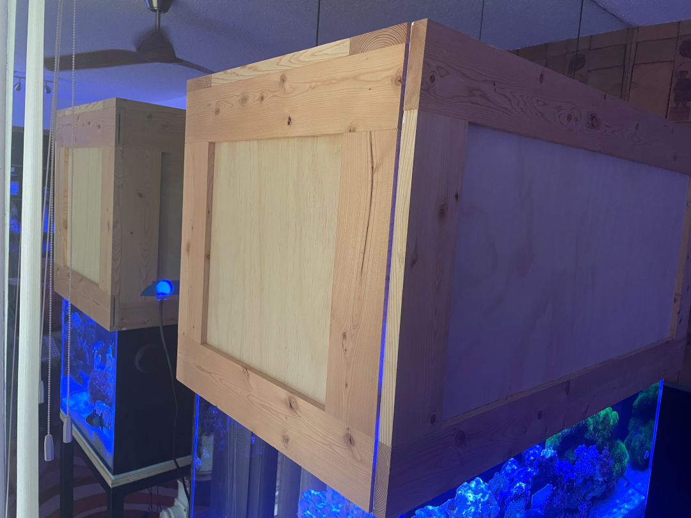
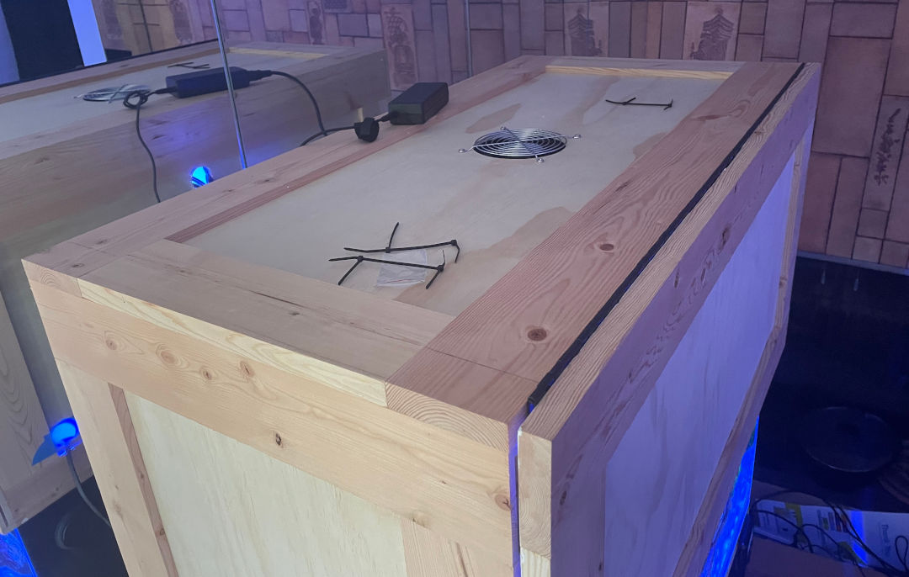

# canopy_calc

Program for calculating the building of an aquarium canopy.

## Finished Result

### Front view

The front panel is affixed to the canopy with a piano hinge, along the top. The front frame
conceals the edges of the other panels, for a clean look from the front.

### Side view

### Top View

## Tools Required

* Seamless joints with a [Biscuit joiner](https://en.wikipedia.org/wiki/Biscuit_joiner). I used the [corded Dewalt joiner](https://www.dewalt.com/product/dw682k/plate-joiner-kit).
* Bar clamps, for clamping the frames together while gluing.
* Air nailer or stapler with 5/8" nails for holding the panels in while they're glued to the frame
* Wood router
* 3/8" chamfer router bit
* Hole saw for cutting holes for cords, ie: powerhead cables, heater cables, temperature controller probes, etc.
* corded jig saw for cutting any special openings for the canopy, such as for auto feeders.

## Materials Required

* 1x4 lumber
* Wood glue. I used contractor grade glue which dries quickly and has fairly good water resistance.
* 1/4" plywood panel. "good 1 side" is recommended, and typically "sanded" panel has a higher quality finish. Avoid using particle board because water will ruin it over time.
* White, gloss exterior paint for the interior.  Glossy paint is easier to wipe and reflects light better. White, for better reflection and low heat build up.
* Biscuits for the biscuit joiner.
* 3/8" Nails/Staples for fastening the panels to the frames while the glue sets.

## Preparing your frame lumber

This project uses 1x4 dimensional lumber which actually has a size of 3/4" by 3-1/2". Dimensional lumber has rounded
corners so it must be cleaned up on both sides with a table saw.

1. Set your table saw fence to trim about 1/8" off the first edge, just enough to square edges.
2. Flip your boards over and set your fence to trim the other rounded edge off.

An example final profile using 1x4 lumber from Lowes in Canada is 3-3/8" x 3/4".

## Building the panel frames

1. Lay out your panel frames on your work bench to preview their assembled dimensions and understand where to plunge your biscuit joiner. Double check dimensions with a tape measure.
2. Plunge your biscuit joiner into the ends of the vertical bars, centering it.
3. Take the width of your vertical bars and divide by 2.  This is the plunge point for the horizontal bars.
4. Measure this half-width from the end of each horizontal bar, and plunge 2x into each vertical bar.
5. "Dry fit" your frames before glueing. This means putting everything together in your clamps, but not gluing things, to ensure it all fits correctly, and rehearse the assembly.
6. If you are glueing the entire panel frame at once, you need to get glue into all biscuit joints before you clamp anything.
7. Follow the instructions included with your chosen glue, particularly the drying time and recommended clamping force.

## Fastening panels to frames

1. Using a 3/8" rabbet bit, route the rear, inner edge of the frame.
2. Dry fit the panels in the frames, good side facing down from the rabetted edge.
3. Remove the panels, apply glue, place back.
4. Staple/nail the panels to hold them in place while the glue sets.

## License

Licensed GNU GPL V3, which can be read in [LICENSE.txt](LICENSE.txt). A copy of this license should be
included but if it's missing, it may be read at [gnu.org](https://www.gnu.org/licenses/gpl-3.0.en.html)